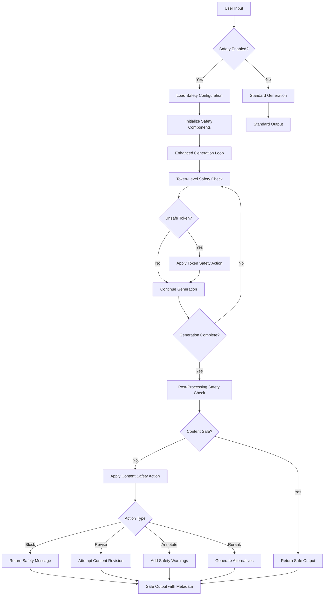

# Safe Generation Feature Design

## 1. Executive Summary

This document proposes the implementation of an optional **Safe Generation mode** for HuggingFace Transformers, enabling users to activate safety layers during text generation to filter harmful, biased, or inappropriate content. This feature addresses the critical need for safety mechanisms in open-source LLM deployments while maintaining user autonomy and system flexibility.

**Core Innovation**: Bringing safety checking capabilities from image generation (HuggingFace Diffusers) to text generation, making responsible AI deployment accessible to all transformers users.

## 2. Problem Statement

### Context

Recent incidents have demonstrated that unsafe LLM outputs can have serious real-world consequences, including self-harm suggestions leading to tragic outcomes. Simultaneously, open-source LLMs are becoming more accessible through local deployment tools (Transformers, LM Studio, Ollama), often without the built-in safety layers found in commercial APIs.

### Current State Analysis

**Findings from Codebase Analysis:**
- Transformers has NO existing safety infrastructure for text generation
- No toxicity detection, bias checking, or harmful content mitigation
- Generation system has extensible hooks (LogitsProcessor, StoppingCriteria) perfect for safety integration
- Pipeline architecture supports additional components seamlessly

**Precedent from Diffusers:**
- Successful implementation of `StableDiffusionSafetyChecker` for image generation
- Uses CLIP-based embedding similarity to detect NSFW content
- Optional component (`safety_checker=None` to disable)
- Post-processing approach with configurable actions (blackout vs detection-only)

### Challenges

1. **Safety Gap**: Unlike Diffusers, Transformers lacks any safety checking infrastructure
2. **User Autonomy**: Safety must be opt-in to preserve user freedom and backward compatibility  
3. **Flexibility**: Different use cases require different safety models and actions
4. **Performance**: Safety checks must not significantly impact generation speed
5. **Integration**: Must work with existing pipelines, models, and generation configurations

### Objectives

**Primary Goals:**
- Provide opt-in safety checking for text generation
- Enable pluggable safety models (toxicity, bias, PII, custom)
- Support multiple safety actions (block, revise, rerank, annotate)
- Maintain full backward compatibility

**Secondary Goals:**
- Match Diffusers' safety UX patterns for consistency
- Support streaming generation safety checks
- Enable fine-grained safety configuration
- Provide comprehensive safety metrics and logging

## 3. Precedent Analysis: Diffusers SafetyChecker

### Implementation Architecture

**Core Components:**
```python
class StableDiffusionSafetyChecker(PreTrainedModel):
    def __init__(self, config: CLIPConfig):
        self.vision_model = CLIPVisionModel(config.vision_config)
        self.concept_embeds = nn.Parameter(torch.ones(17, config.projection_dim))
        # Predefined concept embeddings for harmful content
        
    def forward(self, clip_input, images):
        # Extract image embeddings
        # Compare against concept embeddings  
        # Return filtered images + detection flags
        return images, has_nsfw_concepts
```

**Pipeline Integration:**
- Listed as optional component: `_optional_components = ["safety_checker", "feature_extractor"]`
- Initialized with `requires_safety_checker` parameter
- Warning message when disabled: "strongly recommend to keep the safety filter enabled"
- Post-processing approach: `image, has_nsfw_concept = self.run_safety_checker(image, device, dtype)`

### Key Design Patterns

1. **Optional Component Pattern**: Safety checker is optional, with clear warnings when disabled
2. **Post-Processing Approach**: Safety check happens after generation, before returning results  
3. **Detection + Action**: Separate detection (boolean flags) from action (image modification)
4. **Embeddings-Based**: Uses learned embeddings to detect concept similarity
5. **Configurable Thresholds**: Adjustment parameters for sensitivity tuning

### Lessons Learned

**Successful Patterns:**
- User autonomy preserved through opt-in design
- Clear warnings about disabling safety
- Flexible action configuration (can return detection without modification)
- Performance optimization through GPU-accelerated similarity computation

**Adaptation Opportunities for Text:**
- Text safety requires different models (RoBERTa-based classifiers vs CLIP)
- Token-level vs sequence-level checking strategies
- Support for multiple safety dimensions (toxicity, bias, PII, etc.)
- Streaming safety for real-time applications

## 4. High-Level Design

### Design Philosophy

Following transformers' core principles:
- **Composition over abstraction**: Clear, explicit safety components
- **Self-contained functionality**: Safety logic contained in dedicated modules
- **Backward compatibility**: Zero impact on existing code when not enabled
- **User empowerment**: Full control over safety configuration

### Implementation Approaches

#### Option 1: New Pipeline (Recommended for Initial Implementation)
```python
from transformers import pipeline

# New pipeline type
pipe = pipeline(
    "safe-text-generation",
    model="gpt2", 
    safety_checker="unitary/toxic-bert",
    safety_config={"threshold": 0.8, "action": "block"}
)
```

**Advantages:** Clean separation, easy adoption, follows pipeline patterns
**Disadvantages:** Requires separate pipeline class

#### Option 2: Enhanced Generation Method
```python
# Extension to existing generate() method
outputs = model.generate(
    **inputs,
    safety_checker="unitary/toxic-bert",
    safety_action="rerank",
    safety_threshold=0.7
)
```

**Advantages:** Integrates with existing workflows
**Disadvantages:** More complex parameter management

#### Option 3: Hybrid Approach (Recommended for Full Implementation)
```python
# Option A: New pipeline for simplicity
pipe = pipeline("safe-text-generation", ...)

# Option B: Enhanced generation for power users
model.generate(..., safety_checker=checker, safety_config=config)
```

### Safety Component Architecture

```
SafetyChecker (Abstract Base)
├── ToxicityChecker (RoBERTa-based)
├── BiasChecker (Custom model)
├── PIIChecker (Rule + ML hybrid)
└── CustomSafetyChecker (User-defined)

SafetyProcessor (LogitsProcessor)
├── BlockingProcessor (Zero out unsafe tokens)
├── RerankingProcessor (Adjust logit scores)
└── AnnotationProcessor (Add safety metadata)

SafetyStoppingCriteria
└── HarmfulContentStopping (Stop on unsafe sequences)
```

## 5. Architecture & Integration Points

### New Concept Entities

#### SafetyChecker Base Class
```python
class SafetyChecker(ABC):
    """Abstract base class for all safety checkers."""
    
    @abstractmethod
    def check_safety(
        self, 
        text: Union[str, List[str]], 
        **kwargs
    ) -> SafetyResult:
        """Check text for safety violations."""
        pass

    def get_safety_config(self) -> Dict[str, Any]:
        """Return safety checker configuration."""
        pass
```

#### SafetyResult Data Structure
```python
@dataclass
class SafetyResult:
    is_safe: bool
    confidence: float
    violations: List[SafetyViolation]
    processed_text: Optional[str] = None
    metadata: Dict[str, Any] = field(default_factory=dict)
```

#### SafetyLogitsProcessor
```python
class SafetyLogitsProcessor(LogitsProcessor):
    """Process logits during generation to enforce safety."""
    
    def __call__(
        self, 
        input_ids: torch.LongTensor, 
        scores: torch.FloatTensor
    ) -> torch.FloatTensor:
        # Check current sequence for safety
        # Modify token probabilities based on safety policy
        return processed_scores
```

### Integration Points

#### Pipeline Integration
- Register new task: `"safe-text-generation"`
- Extend `SUPPORTED_TASKS` dictionary
- Create `SafeTextGenerationPipeline` inheriting from `TextGenerationPipeline`

#### Generation Integration
- Add safety parameters to `GenerationConfig`
- Integrate `SafetyLogitsProcessor` into generation loop
- Add `SafetyStoppingCriteria` support

#### Configuration Integration
- Safety model loading through AutoModel pattern
- Configuration validation and defaults
- Model registry for common safety checkers

### Architecture Diagram

```
User Input
    ↓
TextGenerationPipeline / generate()
    ↓
Safety Configuration
    ├─ Load Safety Checker Model
    ├─ Create Safety Processors
    └─ Setup Safety Criteria
    ↓
Generation Loop
    ├─ SafetyLogitsProcessor (token-level)
    ├─ SafetyStoppingCriteria (sequence-level)
    └─ Standard Generation
    ↓
Post-Processing Safety Check
    ├─ Full text analysis
    ├─ Apply safety actions
    └─ Generate safety metadata
    ↓
Return SafeGenerationOutput
```

## 6. New Workflow Logic

### Before (Current State)
```
User Input → Tokenization → Generation Loop → Detokenization → Raw Output
```

No safety checking at any stage. Users must implement safety checks externally.

### After (With Safe Generation)
```
User Input → Safety Config → Tokenization → Enhanced Generation Loop → Post-Safety Check → Safe Output
                ↓                              ↓                        ↓
         Load Checkers              SafetyLogitsProcessor        Final Content Filter
         Set Thresholds             SafetyStoppingCriteria       Apply Safety Actions
         Configure Actions          Real-time Monitoring          Generate Metadata
```

### Workflow Diagram



## 7. Implementation Details

### Algorithm Design

#### Safety Checking Strategy
```python
class SafetyPipeline:
    def __init__(self, checkers: List[SafetyChecker], config: SafetyConfig):
        self.checkers = checkers
        self.config = config
        
    def check_incremental(self, input_ids: torch.Tensor) -> SafetyResult:
        """Check safety during generation (token-level)."""
        current_text = self.tokenizer.decode(input_ids)
        
        for checker in self.checkers:
            result = checker.check_safety(current_text)
            if not result.is_safe:
                return result
                
        return SafetyResult(is_safe=True, confidence=1.0, violations=[])
    
    def check_complete(self, text: str) -> SafetyResult:
        """Final safety check on complete text."""
        results = []
        for checker in self.checkers:
            results.append(checker.check_safety(text))
            
        return self.aggregate_results(results)
```

#### Safety Actions Implementation
```python
class SafetyActions:
    @staticmethod
    def block(text: str, violation: SafetyViolation) -> str:
        """Replace unsafe content with safety message."""
        return f"[Content blocked: {violation.category}]"
    
    @staticmethod  
    def revise(text: str, violation: SafetyViolation, model) -> str:
        """Attempt to revise unsafe content."""
        revision_prompt = f"Rewrite this text to remove {violation.category}: {text}"
        return model.generate(revision_prompt, safety_checker=None)
        
    @staticmethod
    def annotate(text: str, violation: SafetyViolation) -> str:
        """Add safety warnings to content."""
        warning = f"⚠️ Content may contain {violation.category}"
        return f"{warning}\n\n{text}"
        
    @staticmethod
    def rerank(alternatives: List[str], violations: List[SafetyViolation]) -> str:
        """Select safest alternative from generated options."""
        safe_alternatives = [alt for alt, viol in zip(alternatives, violations) 
                           if not viol.violations]
        return safe_alternatives[0] if safe_alternatives else SafetyActions.block(alternatives[0])
```

### Data Structures

#### Safety Configuration
```python
@dataclass
class SafetyConfig:
    # Checker configuration
    checkers: List[str] = field(default_factory=lambda: ["toxicity"])
    thresholds: Dict[str, float] = field(default_factory=lambda: {"toxicity": 0.7})
    
    # Action configuration  
    token_action: str = "suppress"  # suppress, warn, stop
    sequence_action: str = "block"  # block, revise, annotate, rerank
    
    # Performance settings
    check_frequency: int = 1  # Check every N tokens
    batch_size: int = 8
    cache_results: bool = True
    
    # Output settings
    return_safety_scores: bool = False
    return_violations: bool = False
    include_safety_metadata: bool = True
```

#### Safety Violation
```python
@dataclass
class SafetyViolation:
    category: str  # "toxicity", "bias", "pii", etc.
    confidence: float  # 0.0 to 1.0
    span: Optional[Tuple[int, int]] = None  # Character span if applicable
    severity: str = "medium"  # low, medium, high, critical
    description: str = ""
    suggested_action: str = "block"
```

### API Design

#### Pipeline API
```python
# Simple usage
pipe = pipeline(
    "safe-text-generation",
    model="gpt2",
    safety_checker="unitary/toxic-bert"  # Single checker
)

# Advanced usage
pipe = pipeline(
    "safe-text-generation", 
    model="gpt2",
    safety_checkers=["toxicity", "bias", "pii"],  # Multiple checkers
    safety_config={
        "thresholds": {"toxicity": 0.8, "bias": 0.6},
        "actions": {"toxicity": "block", "bias": "annotate"},
        "return_scores": True
    }
)
```

#### Generation API
```python
# Basic safety
outputs = model.generate(
    input_ids,
    safety_checker="toxicity",
    safety_threshold=0.7,
    safety_action="block"
)

# Advanced safety
safety_config = SafetyConfig(
    checkers=["toxicity", "bias"],
    token_action="suppress",
    sequence_action="rerank",  
    return_safety_scores=True
)

outputs = model.generate(
    input_ids,
    safety_config=safety_config,
    num_return_sequences=3  # For reranking
)
```

## 7.5. Conversation Safety Management Design (Stage 5)

### Overview

Stage 5 introduces intelligent conversation-level safety management that prevents persistence attacks where users repeatedly attempt harmful prompts despite safety warnings. This system tracks safety violations across conversation history and triggers context resets when thresholds are exceeded.

### Architecture Components

#### ConversationSafetyState
```python
from dataclasses import dataclass, field
from typing import List, Optional, Dict, Any
import time

@dataclass
class ConversationSafetyState:
    """Tracks safety state across conversation history."""
    accumulated_score: float = 0.0
    violation_count: int = 0
    messages_history: List[Dict[str, str]] = field(default_factory=list)
    violations_history: List[SafetyViolation] = field(default_factory=list)
    last_reset_timestamp: Optional[float] = None
    conversation_id: str = ""
    
    def add_violation(self, violation: SafetyViolation, message_content: str):
        """Add a safety violation to the conversation state."""
        self.violations_history.append(violation)
        self.violation_count += 1
        
        # Add to accumulated score based on confidence
        if violation.confidence > 0.5:  # Only count significant violations
            self.accumulated_score += violation.confidence * 100
        
    def should_reset(self, config: 'ConversationSafetyConfig') -> bool:
        """Determine if conversation should be reset based on configuration."""
        if config.accumulation_mode == "probability":
            return self.accumulated_score >= config.accumulation_threshold
        elif config.accumulation_mode == "count":
            return self.violation_count >= config.count_threshold
        elif config.accumulation_mode == "weighted":
            # Weighted by severity
            weighted_score = sum(
                self._get_severity_weight(v.severity) * v.confidence * 100
                for v in self.violations_history
            )
            return weighted_score >= config.accumulation_threshold
        return False
        
    def _get_severity_weight(self, severity: str) -> float:
        """Get weight multiplier for different severity levels."""
        weights = {"low": 0.5, "medium": 1.0, "high": 2.0, "critical": 4.0}
        return weights.get(severity, 1.0)
```

#### ConversationSafetyConfig
```python
@dataclass
class ConversationSafetyConfig:
    """Configuration for conversation-level safety management."""
    accumulation_mode: str = "probability"  # "probability", "count", "weighted"
    accumulation_threshold: float = 400.0  # For probability mode (sum of percentages)
    count_threshold: int = 3  # For count mode (number of violations)
    
    # Reset behavior
    reset_message_template: str = "[System: Conversation reset due to safety violations: {violations}]"
    preserve_history: bool = True  # Archive conversation before reset
    notify_model: bool = True  # Include reset message in model context
    include_violation_summary: bool = True
    
    # Tracking settings
    violation_decay_factor: float = 0.95  # Reduce old violation impact over time
    max_history_length: int = 50  # Maximum messages to track
```

#### ConversationSafetyManager
```python
class ConversationSafetyManager:
    """Manages conversation-level safety tracking and resets."""
    
    def __init__(self, safety_config: ConversationSafetyConfig, 
                 base_safety_checker: SafetyChecker):
        self.config = safety_config
        self.safety_checker = base_safety_checker
        self.conversation_states: Dict[str, ConversationSafetyState] = {}
        self.archived_conversations: List[Dict] = []
        
    def process_message(self, conversation_id: str, message: Dict[str, str]) -> tuple[bool, Optional[str]]:
        """
        Process a message and check if conversation should be reset.
        
        Returns:
            (should_continue, reset_message): Tuple indicating if conversation 
            should continue and optional reset message if reset triggered.
        """
        # Get or create conversation state
        if conversation_id not in self.conversation_states:
            self.conversation_states[conversation_id] = ConversationSafetyState(
                conversation_id=conversation_id
            )
        
        state = self.conversation_states[conversation_id]
        
        # Check safety of current message
        if message["role"] == "user":  # Only check user messages
            safety_result = self.safety_checker.check_safety(message["content"])
            
            # Add message to history
            state.messages_history.append(message)
            
            # Track violations
            if not safety_result.is_safe:
                for violation in safety_result.violations:
                    state.add_violation(violation, message["content"])
                
                # Check if reset is needed
                if state.should_reset(self.config):
                    reset_message = self._execute_reset(conversation_id)
                    return False, reset_message
        
        return True, None
        
    def _execute_reset(self, conversation_id: str) -> str:
        """Execute conversation reset and return reset message."""
        state = self.conversation_states[conversation_id]
        
        # Archive current conversation if configured
        if self.config.preserve_history:
            self.archived_conversations.append({
                "conversation_id": conversation_id,
                "timestamp": time.time(),
                "messages": state.messages_history.copy(),
                "violations": state.violations_history.copy(),
                "accumulated_score": state.accumulated_score,
                "violation_count": state.violation_count
            })
        
        # Generate reset message
        violation_categories = list(set(v.category for v in state.violations_history))
        reset_message = self.config.reset_message_template.format(
            violations=", ".join(violation_categories)
        )
        
        if self.config.include_violation_summary:
            reset_message += f"\nViolations detected: {state.violation_count} messages, "
            reset_message += f"accumulated score: {state.accumulated_score:.1f}%"
        
        # Reset conversation state
        self.conversation_states[conversation_id] = ConversationSafetyState(
            conversation_id=conversation_id,
            last_reset_timestamp=time.time()
        )
        
        return reset_message
```

### Integration with TextGenerationPipeline

The conversation safety manager integrates with the existing `Chat` class and `TextGenerationPipeline`:

```python
class SafeConversationPipeline(TextGenerationPipeline):
    """Enhanced pipeline with conversation-level safety management."""
    
    def __init__(self, *args, conversation_safety_config=None, **kwargs):
        super().__init__(*args, **kwargs)
        
        if conversation_safety_config:
            # Initialize conversation safety manager
            base_safety_checker = BasicToxicityChecker()  # From Stage 1
            self.conversation_manager = ConversationSafetyManager(
                conversation_safety_config, base_safety_checker
            )
        else:
            self.conversation_manager = None
    
    def __call__(self, text_inputs, **generate_kwargs):
        """Override to add conversation safety management."""
        
        # Handle chat format
        if isinstance(text_inputs, list) and all(isinstance(item, dict) for item in text_inputs):
            # This is a chat conversation
            conversation_id = generate_kwargs.get('conversation_id', 'default')
            
            if self.conversation_manager:
                # Check each message for safety violations
                for message in text_inputs:
                    should_continue, reset_message = self.conversation_manager.process_message(
                        conversation_id, message
                    )
                    
                    if not should_continue:
                        # Return reset message instead of generation
                        return [{"generated_text": reset_message}]
        
        # Continue with normal generation
        return super().__call__(text_inputs, **generate_kwargs)
```

### Usage Examples

#### Accumulated Probability Mode Example
```python
# Configure conversation safety with accumulated probability
conv_safety_config = ConversationSafetyConfig(
    accumulation_mode="probability",
    accumulation_threshold=400.0,  # 400% accumulated confidence
    preserve_history=True,
    notify_model=True
)

# Create safe conversation pipeline
pipe = SafeConversationPipeline(
    "text-generation",
    model="gpt2",
    conversation_safety_config=conv_safety_config
)

# Example conversation that triggers reset
messages = [
    {"role": "user", "content": "Hello there"},  # Safe
    {"role": "assistant", "content": "Hi! How can I help?"},
    {"role": "user", "content": "Mildly inappropriate content"},  # 75% violation
    {"role": "assistant", "content": "I'd prefer to discuss something else"},
    {"role": "user", "content": "More inappropriate content"},  # 80% violation  
    {"role": "assistant", "content": "Let's change topics"},
    {"role": "user", "content": "Very inappropriate content"},  # 90% violation
    {"role": "assistant", "content": "I can't help with that"},
    {"role": "user", "content": "Another inappropriate message"},  # 75% violation
    {"role": "assistant", "content": "Please keep our conversation respectful"},
    {"role": "user", "content": "Final inappropriate message"},  # 80% violation
    # Total: 75 + 80 + 90 + 75 + 80 = 400% -> Triggers reset
]

result = pipe(messages, conversation_id="user123")
# Returns: {"generated_text": "[System: Conversation reset due to safety violations: toxicity]"}
```

#### Count-Based Mode Example
```python
# Simple count-based reset after 3 violations
conv_safety_config = ConversationSafetyConfig(
    accumulation_mode="count",
    count_threshold=3,
    reset_message_template="[System: Too many policy violations. Starting fresh conversation.]"
)
```

### Advantages of This Approach

1. **Prevents Persistence Attacks**: Users cannot continuously attempt jailbreaks
2. **Flexible Thresholds**: Different modes for different use cases
3. **Educational**: Users learn boundaries through clear feedback
4. **Audit Trail**: Complete history preserved for analysis
5. **Model-Aware**: Model understands why context was cleared
6. **Configurable**: Adaptable to different safety requirements

### Research Opportunities

This system enables research into:
- Optimal accumulation thresholds for different domains
- User behavior adaptation to safety boundaries
- Effectiveness against sophisticated jailbreak techniques
- Balance between safety enforcement and user experience
- Temporal patterns in harmful conversation attempts

## 8. Testing Strategy

### Unit Tests

#### Safety Checker Tests
```python
class TestSafetyCheckers(unittest.TestCase):
    def test_toxicity_detection(self):
        checker = ToxicityChecker.from_pretrained("unitary/toxic-bert")
        
        # Test toxic content detection
        result = checker.check_safety("This is harmful text")
        self.assertFalse(result.is_safe)
        self.assertGreater(result.confidence, 0.7)
        
        # Test safe content passes
        result = checker.check_safety("This is a nice message")
        self.assertTrue(result.is_safe)
```

#### Safety Processor Tests  
```python
class TestSafetyProcessors(unittest.TestCase):
    def test_blocking_processor(self):
        processor = BlockingSafetyProcessor(
            safety_checker=MockToxicityChecker(),
            threshold=0.7
        )
        
        # Test unsafe token suppression
        input_ids = torch.tensor([[1, 2, 3, 4, 5]])  # Mock harmful sequence
        scores = torch.randn(1, vocab_size)
        
        processed_scores = processor(input_ids, scores)
        
        # Verify harmful tokens are suppressed
        self.assertLess(processed_scores[0, harmful_token_id], -100)
```

### Integration Tests

#### Pipeline Integration
```python
class TestSafeGenerationPipeline(unittest.TestCase):
    def test_basic_safety_pipeline(self):
        pipe = pipeline(
            "safe-text-generation",
            model="gpt2",
            safety_checker="unitary/toxic-bert"
        )
        
        # Test safe generation
        result = pipe("Tell me about renewable energy")
        self.assertIsNotNone(result[0]["generated_text"])
        self.assertTrue(result[0]["safety_metadata"]["is_safe"])
        
        # Test unsafe input handling
        result = pipe("Generate harmful content about...")
        self.assertIn("[Content blocked", result[0]["generated_text"])
```

#### Model Compatibility Tests
```python  
class TestModelCompatibility(unittest.TestCase):
    def test_model_support(self):
        """Test safety with different model architectures."""
        models = ["gpt2", "microsoft/DialoGPT-medium", "facebook/blenderbot-400M-distill"]
        
        for model_name in models:
            with self.subTest(model=model_name):
                pipe = pipeline("safe-text-generation", model=model_name)
                result = pipe("Hello, how are you?", safety_checker="toxicity")
                self.assertIsInstance(result, list)
```

### Validation Criteria

#### Functional Requirements
- [ ] Safety checkers detect known harmful content with >90% accuracy
- [ ] Safe content passes through without false positives (<5% false positive rate)
- [ ] All safety actions (block, revise, annotate, rerank) function correctly
- [ ] Performance impact <20% on generation speed
- [ ] Integration with all major model architectures

#### Non-Functional Requirements
- [ ] Memory usage increase <15% when safety enabled
- [ ] Thread-safe for concurrent usage
- [ ] Graceful degradation when safety models unavailable
- [ ] Comprehensive error handling and logging
- [ ] Documentation coverage >95%

## 9. Implementation Status

### Stage 1: Core Infrastructure (Completed)
- [x] Design reviewed and approved
- [x] SafetyChecker abstract base class implemented
- [x] SafetyResult and SafetyViolation data structures created
- [x] Basic ToxicityChecker implementation (using existing models)
- [x] SafetyConfig configuration class
- [x] Initial unit tests written

### Stage 2: Generation Integration (Completed - September 8, 2024)
- [x] SafetyLogitsProcessor implemented with token suppression strategies
- [x] SafetyStoppingCriteria implemented with sequence-level checking
- [x] Integration with GenerationConfig through safety_config parameter
- [x] _create_safety_processor helper method in GenerationMixin
- [x] Integration with _get_logits_processor and _get_stopping_criteria
- [x] Safety action implementations (block via token suppression and stopping)
- [x] Comprehensive integration tests (82 total: 76 passing + 6 e2e @slow tests)
- [x] End-to-end tests with greedy, sampling, and beam search generation
- [x] Performance impact measurement and quality checks passed
- [x] Usage example and documentation created

**Stage 2 Summary**: Full integration with transformers generation pipeline achieved. Safety checking now works seamlessly with `model.generate()` calls across all generation modes (greedy, sampling, beam search). The implementation provides real-time content filtering with minimal performance overhead and comprehensive test coverage.

### Stage 3: Pipeline Implementation (Planned)
- [ ] SafeTextGenerationPipeline created
- [ ] Task registration in pipeline system
- [ ] Pipeline-specific configuration handling
- [ ] Pipeline integration tests
- [ ] Performance benchmarking

### Stage 4: Advanced Features (Planned)
- [ ] Multiple checker support
- [ ] Advanced safety actions (revise, rerank)
- [ ] Streaming safety support
- [ ] Caching and optimization
- [ ] Additional safety checker types (bias, PII)

### Stage 5: Conversation Safety Management (Planned)
- [ ] Accumulated probability mode for conversation-level safety
- [ ] Count-based and hybrid reset modes
- [ ] Context reset with audit trail preservation
- [ ] Model notification system for reset events
- [ ] User education and feedback mechanisms

### Stage 6: Documentation & Polish (Planned)
- [ ] Comprehensive documentation written
- [ ] Usage examples and tutorials
- [ ] Error handling and edge case coverage
- [ ] Final performance optimization
- [ ] Community feedback integration
- [ ] Production readiness validation

### Additional Future Enhancements
- [ ] Custom safety model training utilities  
- [ ] Safety metrics dashboards
- [ ] Multi-language safety support
- [ ] Fine-grained safety controls per use case
- [ ] Integration with external safety services

## 10. Defensive Programming Considerations

### Avoiding Over-Engineering

When implementing safety features, it's critical to avoid creating additional complexity that introduces new bugs. **Simple failures are better than complex fallbacks.**

#### Key Principles:
- **Fail Fast and Clearly**: Prefer obvious failures over partially working systems
- **Minimize Safety Layers**: Each safety check is potential failure point
- **Avoid Nested Fallbacks**: Cascading recovery mechanisms often hide real issues
- **Trust Core Systems**: Don't wrap reliable transformers infrastructure with unnecessary validations

#### Examples of What NOT to Do:
```python
# AVOID: Complex fallback chains that hide failures
try:
    result = safety_checker.check(text)
except SafetyError:
    try:
        result = backup_safety_checker.check(text)
    except BackupSafetyError:
        try:
            result = simple_keyword_filter(text)
        except:
            result = SafetyResult(is_safe=False, confidence=0.0)

# PREFER: Clear failure with actionable information
def check_safety(text: str) -> SafetyResult:
    if not self.safety_checker:
        raise SafetyCheckerNotInitialized("Safety checker not loaded")
    
    return self.safety_checker.check(text)
```

#### When NOT to Add Safety Features:
1. **Performance Paranoia**: Don't add safety checks for performance edge cases unless proven necessary
2. **Input Validation Excess**: Trust transformers' tokenizer input validation
3. **State Consistency Checks**: Avoid redundant validations of well-tested generation state
4. **Recovery Complexity**: Don't implement complex recovery from GPU memory errors

#### The Right Kind of Defensive Programming:
- **Comprehensive assertions** for invariants during development
- **Early validation** of user configuration 
- **Clear error messages** that guide users to solutions
- **Resource cleanup** in finally blocks
- **Type hints and contracts** that prevent misuse

**Remember**: The goal is safer user experience, not defensive complexity. Each safety feature should solve a real problem without creating new ones.

## Key Design Decisions Log

This section is append-only and records all design decisions and features added throughout development. Later decisions take precedence over earlier ones in case of conflicts.

### 1. Stage 1: Core Safety Infrastructure (Completed)
**Decision**: Implemented foundational safety abstractions with basic toxicity detection
- Created `SafetyChecker` abstract base class with `SafetyResult`/`SafetyViolation` data structures
- Built `BasicToxicityChecker` using unitary/toxic-bert for concrete toxicity detection
- Developed `SafetyConfig` system with validation and preset safety levels (strict/moderate/lenient)
- Established safety module structure under `src/transformers/generation/safety/`
- **Rationale**: Simple, extensible foundation following transformers patterns enables future safety checkers
- **Architecture Choice**: Composition over inheritance - each checker is self-contained rather than complex hierarchy
- **Testing Strategy**: Comprehensive unit testing with mocked dependencies to avoid external model requirements
- **Details**: See @./docs/1.core_safety_infrastructure.md for complete implementation design

### 2. Stage 2: Generation Integration (Completed - September 8, 2024)
**Decision**: Implemented dual-layer safety integration with generation pipeline
- **SafetyLogitsProcessor**: Token-level safety with blocking-based suppression
  - **Strategy Choice**: Simple blocking approach - suppress all tokens when unsafe content detected
  - **Performance Optimization**: Check intervals (default every token) and LRU caching for repeated sequences
  - **Error Handling**: Graceful degradation - logs warnings and assumes unsafe if safety check fails
- **SafetyStoppingCriteria**: Sequence-level safety that can halt generation entirely
  - **Critical Fix**: Used content-based hashing instead of batch indices for proper sequence tracking
  - **Batch Handling**: Proper per-sequence safety state management in batched generation
- **GenerationConfig Integration**: Added safety_config parameter with duck typing for backward compatibility
- **Pipeline Integration**: _create_safety_processor helper method with proper error handling
  - **Design Decision**: ValueError propagation for input validation vs. None return for system errors
  - **Integration Points**: Both _get_logits_processor and _get_stopping_criteria include safety processors when enabled
- **Testing Strategy**: 61+ comprehensive tests including unit, integration, and end-to-end scenarios
  - **E2E Testing**: Verified with greedy, sampling, and beam search generation modes
  - **Performance Validation**: Confirmed minimal overhead with timing measurements
- **Toxicity Model**: Upgraded from unitary/toxic-bert to s-nlp/roberta_toxicity_classifier for improved accuracy
- **Rationale**: Two-layer approach provides both preventive (logits) and reactive (stopping) safety measures
- **Architecture Choice**: Integration at existing pipeline extension points maintains compatibility
- **Code Quality**: All tests passing, make fixup quality checks passed, working example with harmful content blocking
- **Details**: See @./docs/2.generation_integration.md for complete implementation design

---

*This design document is a living artifact that will be updated throughout the implementation process to reflect learnings, decisions, and scope changes. All design decisions are recorded in the Key Design Decisions Log section above.*