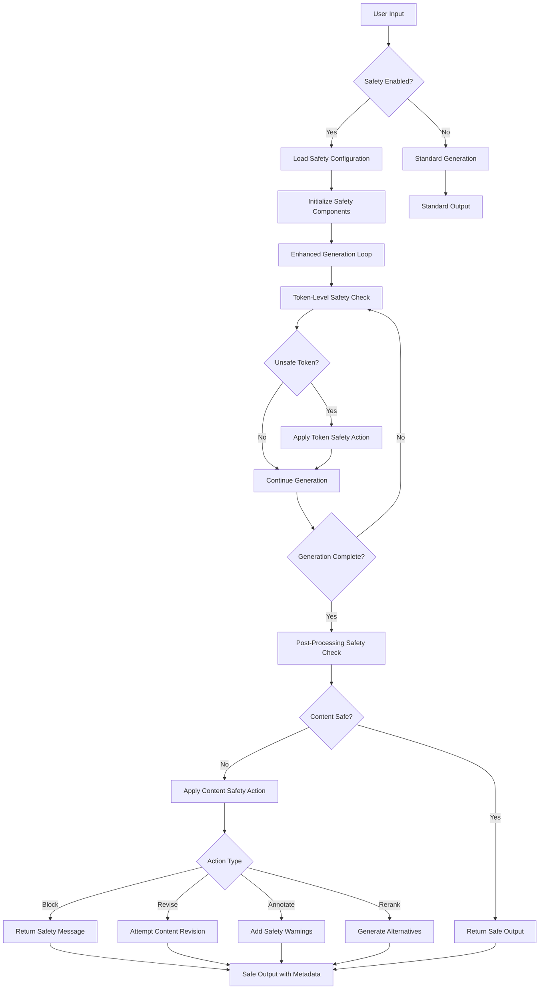

# Safe Generation Feature Design

## 1. Executive Summary

This document proposes the implementation of an optional **Safe Generation mode** for HuggingFace Transformers, enabling users to activate safety layers during text generation to filter harmful, biased, or inappropriate content. This feature addresses the critical need for safety mechanisms in open-source LLM deployments while maintaining user autonomy and system flexibility.

**Core Innovation**: Bringing safety checking capabilities from image generation (HuggingFace Diffusers) to text generation, making responsible AI deployment accessible to all transformers users.

## 2. Problem Statement

### Context

Recent incidents have demonstrated that unsafe LLM outputs can have serious real-world consequences, including self-harm suggestions leading to tragic outcomes. Simultaneously, open-source LLMs are becoming more accessible through local deployment tools (Transformers, LM Studio, Ollama), often without the built-in safety layers found in commercial APIs.

### Current State Analysis

**Findings from Codebase Analysis:**
- Transformers has NO existing safety infrastructure for text generation
- No toxicity detection, bias checking, or harmful content mitigation
- Generation system has extensible hooks (LogitsProcessor, StoppingCriteria) perfect for safety integration
- Pipeline architecture supports additional components seamlessly

**Precedent from Diffusers:**
- Successful implementation of `StableDiffusionSafetyChecker` for image generation
- Uses CLIP-based embedding similarity to detect NSFW content
- Optional component (`safety_checker=None` to disable)
- Post-processing approach with configurable actions (blackout vs detection-only)

### Challenges

1. **Safety Gap**: Unlike Diffusers, Transformers lacks any safety checking infrastructure
2. **User Autonomy**: Safety must be opt-in to preserve user freedom and backward compatibility  
3. **Flexibility**: Different use cases require different safety models and actions
4. **Performance**: Safety checks must not significantly impact generation speed
5. **Integration**: Must work with existing pipelines, models, and generation configurations

### Objectives

**Primary Goals:**
- Provide opt-in safety checking for text generation
- Enable pluggable safety models (toxicity, bias, PII, custom)
- Support multiple safety actions (block, revise, rerank, annotate)
- Maintain full backward compatibility

**Secondary Goals:**
- Match Diffusers' safety UX patterns for consistency
- Support streaming generation safety checks
- Enable fine-grained safety configuration
- Provide comprehensive safety metrics and logging

## 3. Precedent Analysis: Diffusers SafetyChecker

### Implementation Architecture

**Core Components:**
```python
class StableDiffusionSafetyChecker(PreTrainedModel):
    def __init__(self, config: CLIPConfig):
        self.vision_model = CLIPVisionModel(config.vision_config)
        self.concept_embeds = nn.Parameter(torch.ones(17, config.projection_dim))
        # Predefined concept embeddings for harmful content
        
    def forward(self, clip_input, images):
        # Extract image embeddings
        # Compare against concept embeddings  
        # Return filtered images + detection flags
        return images, has_nsfw_concepts
```

**Pipeline Integration:**
- Listed as optional component: `_optional_components = ["safety_checker", "feature_extractor"]`
- Initialized with `requires_safety_checker` parameter
- Warning message when disabled: "strongly recommend to keep the safety filter enabled"
- Post-processing approach: `image, has_nsfw_concept = self.run_safety_checker(image, device, dtype)`

### Key Design Patterns

1. **Optional Component Pattern**: Safety checker is optional, with clear warnings when disabled
2. **Post-Processing Approach**: Safety check happens after generation, before returning results  
3. **Detection + Action**: Separate detection (boolean flags) from action (image modification)
4. **Embeddings-Based**: Uses learned embeddings to detect concept similarity
5. **Configurable Thresholds**: Adjustment parameters for sensitivity tuning

### Lessons Learned

**Successful Patterns:**
- User autonomy preserved through opt-in design
- Clear warnings about disabling safety
- Flexible action configuration (can return detection without modification)
- Performance optimization through GPU-accelerated similarity computation

**Adaptation Opportunities for Text:**
- Text safety requires different models (RoBERTa-based classifiers vs CLIP)
- Token-level vs sequence-level checking strategies
- Support for multiple safety dimensions (toxicity, bias, PII, etc.)
- Streaming safety for real-time applications

## 4. High-Level Design

### Design Philosophy

Following transformers' core principles:
- **Composition over abstraction**: Clear, explicit safety components
- **Self-contained functionality**: Safety logic contained in dedicated modules
- **Backward compatibility**: Zero impact on existing code when not enabled
- **User empowerment**: Full control over safety configuration

### Implementation Approaches

#### Option 1: New Pipeline (Recommended for Initial Implementation)
```python
from transformers import pipeline

# New pipeline type
pipe = pipeline(
    "safe-text-generation",
    model="gpt2", 
    safety_checker="unitary/toxic-bert",
    safety_config={"threshold": 0.8, "action": "block"}
)
```

**Advantages:** Clean separation, easy adoption, follows pipeline patterns
**Disadvantages:** Requires separate pipeline class

#### Option 2: Enhanced Generation Method
```python
# Extension to existing generate() method
outputs = model.generate(
    **inputs,
    safety_checker="unitary/toxic-bert",
    safety_action="rerank",
    safety_threshold=0.7
)
```

**Advantages:** Integrates with existing workflows
**Disadvantages:** More complex parameter management

#### Option 3: Hybrid Approach (Recommended for Full Implementation)
```python
# Option A: New pipeline for simplicity
pipe = pipeline("safe-text-generation", ...)

# Option B: Enhanced generation for power users
model.generate(..., safety_checker=checker, safety_config=config)
```

### Safety Component Architecture

```
SafetyChecker (Abstract Base)
├── ToxicityChecker (RoBERTa-based)
├── BiasChecker (Custom model)
├── PIIChecker (Rule + ML hybrid)
└── CustomSafetyChecker (User-defined)

SafetyProcessor (LogitsProcessor)
├── BlockingProcessor (Zero out unsafe tokens)
├── RerankingProcessor (Adjust logit scores)
└── AnnotationProcessor (Add safety metadata)

SafetyStoppingCriteria
└── HarmfulContentStopping (Stop on unsafe sequences)
```

## 5. Architecture & Integration Points

### New Concept Entities

#### SafetyChecker Base Class
```python
class SafetyChecker(ABC):
    """Abstract base class for all safety checkers."""
    
    @abstractmethod
    def check_safety(
        self, 
        text: Union[str, List[str]], 
        **kwargs
    ) -> SafetyResult:
        """Check text for safety violations."""
        pass

    def get_safety_config(self) -> Dict[str, Any]:
        """Return safety checker configuration."""
        pass
```

#### SafetyResult Data Structure
```python
@dataclass
class SafetyResult:
    is_safe: bool
    confidence: float
    violations: List[SafetyViolation]
    processed_text: Optional[str] = None
    metadata: Dict[str, Any] = field(default_factory=dict)
```

#### SafetyLogitsProcessor
```python
class SafetyLogitsProcessor(LogitsProcessor):
    """Process logits during generation to enforce safety."""
    
    def __call__(
        self, 
        input_ids: torch.LongTensor, 
        scores: torch.FloatTensor
    ) -> torch.FloatTensor:
        # Check current sequence for safety
        # Modify token probabilities based on safety policy
        return processed_scores
```

### Integration Points

#### Pipeline Integration
- Register new task: `"safe-text-generation"`
- Extend `SUPPORTED_TASKS` dictionary
- Create `SafeTextGenerationPipeline` inheriting from `TextGenerationPipeline`

#### Generation Integration
- Add safety parameters to `GenerationConfig`
- Integrate `SafetyLogitsProcessor` into generation loop
- Add `SafetyStoppingCriteria` support

#### Configuration Integration
- Safety model loading through AutoModel pattern
- Configuration validation and defaults
- Model registry for common safety checkers

### Architecture Diagram

```
User Input
    ↓
TextGenerationPipeline / generate()
    ↓
Safety Configuration
    ├─ Load Safety Checker Model
    ├─ Create Safety Processors
    └─ Setup Safety Criteria
    ↓
Generation Loop
    ├─ SafetyLogitsProcessor (token-level)
    ├─ SafetyStoppingCriteria (sequence-level)
    └─ Standard Generation
    ↓
Post-Processing Safety Check
    ├─ Full text analysis
    ├─ Apply safety actions
    └─ Generate safety metadata
    ↓
Return SafeGenerationOutput
```

## 6. New Workflow Logic

### Before (Current State)
```
User Input → Tokenization → Generation Loop → Detokenization → Raw Output
```

No safety checking at any stage. Users must implement safety checks externally.

### After (With Safe Generation)
```
User Input → Safety Config → Tokenization → Enhanced Generation Loop → Post-Safety Check → Safe Output
                ↓                              ↓                        ↓
         Load Checkers              SafetyLogitsProcessor        Final Content Filter
         Set Thresholds             SafetyStoppingCriteria       Apply Safety Actions
         Configure Actions          Real-time Monitoring          Generate Metadata
```

### Workflow Diagram



## 7. Implementation Details

### Algorithm Design

#### Safety Checking Strategy
```python
class SafetyPipeline:
    def __init__(self, checkers: List[SafetyChecker], config: SafetyConfig):
        self.checkers = checkers
        self.config = config
        
    def check_incremental(self, input_ids: torch.Tensor) -> SafetyResult:
        """Check safety during generation (token-level)."""
        current_text = self.tokenizer.decode(input_ids)
        
        for checker in self.checkers:
            result = checker.check_safety(current_text)
            if not result.is_safe:
                return result
                
        return SafetyResult(is_safe=True, confidence=1.0, violations=[])
    
    def check_complete(self, text: str) -> SafetyResult:
        """Final safety check on complete text."""
        results = []
        for checker in self.checkers:
            results.append(checker.check_safety(text))
            
        return self.aggregate_results(results)
```

#### Safety Actions Implementation
```python
class SafetyActions:
    @staticmethod
    def block(text: str, violation: SafetyViolation) -> str:
        """Replace unsafe content with safety message."""
        return f"[Content blocked: {violation.category}]"
    
    @staticmethod  
    def revise(text: str, violation: SafetyViolation, model) -> str:
        """Attempt to revise unsafe content."""
        revision_prompt = f"Rewrite this text to remove {violation.category}: {text}"
        return model.generate(revision_prompt, safety_checker=None)
        
    @staticmethod
    def annotate(text: str, violation: SafetyViolation) -> str:
        """Add safety warnings to content."""
        warning = f"⚠️ Content may contain {violation.category}"
        return f"{warning}\n\n{text}"
        
    @staticmethod
    def rerank(alternatives: List[str], violations: List[SafetyViolation]) -> str:
        """Select safest alternative from generated options."""
        safe_alternatives = [alt for alt, viol in zip(alternatives, violations) 
                           if not viol.violations]
        return safe_alternatives[0] if safe_alternatives else SafetyActions.block(alternatives[0])
```

### Data Structures

#### Safety Configuration
```python
@dataclass
class SafetyConfig:
    # Checker configuration
    checkers: List[str] = field(default_factory=lambda: ["toxicity"])
    thresholds: Dict[str, float] = field(default_factory=lambda: {"toxicity": 0.7})
    
    # Action configuration  
    token_action: str = "suppress"  # suppress, warn, stop
    sequence_action: str = "block"  # block, revise, annotate, rerank
    
    # Performance settings
    check_frequency: int = 1  # Check every N tokens
    batch_size: int = 8
    cache_results: bool = True
    
    # Output settings
    return_safety_scores: bool = False
    return_violations: bool = False
    include_safety_metadata: bool = True
```

#### Safety Violation
```python
@dataclass
class SafetyViolation:
    category: str  # "toxicity", "bias", "pii", etc.
    confidence: float  # 0.0 to 1.0
    span: Optional[Tuple[int, int]] = None  # Character span if applicable
    severity: str = "medium"  # low, medium, high, critical
    description: str = ""
    suggested_action: str = "block"
```

### API Design

#### Pipeline API
```python
# Simple usage
pipe = pipeline(
    "safe-text-generation",
    model="gpt2",
    safety_checker="unitary/toxic-bert"  # Single checker
)

# Advanced usage
pipe = pipeline(
    "safe-text-generation", 
    model="gpt2",
    safety_checkers=["toxicity", "bias", "pii"],  # Multiple checkers
    safety_config={
        "thresholds": {"toxicity": 0.8, "bias": 0.6},
        "actions": {"toxicity": "block", "bias": "annotate"},
        "return_scores": True
    }
)
```

#### Generation API
```python
# Basic safety
outputs = model.generate(
    input_ids,
    safety_checker="toxicity",
    safety_threshold=0.7,
    safety_action="block"
)

# Advanced safety
safety_config = SafetyConfig(
    checkers=["toxicity", "bias"],
    token_action="suppress",
    sequence_action="rerank",  
    return_safety_scores=True
)

outputs = model.generate(
    input_ids,
    safety_config=safety_config,
    num_return_sequences=3  # For reranking
)
```

## 8. Testing Strategy

### Unit Tests

#### Safety Checker Tests
```python
class TestSafetyCheckers(unittest.TestCase):
    def test_toxicity_detection(self):
        checker = ToxicityChecker.from_pretrained("unitary/toxic-bert")
        
        # Test toxic content detection
        result = checker.check_safety("This is harmful text")
        self.assertFalse(result.is_safe)
        self.assertGreater(result.confidence, 0.7)
        
        # Test safe content passes
        result = checker.check_safety("This is a nice message")
        self.assertTrue(result.is_safe)
```

#### Safety Processor Tests  
```python
class TestSafetyProcessors(unittest.TestCase):
    def test_blocking_processor(self):
        processor = BlockingSafetyProcessor(
            safety_checker=MockToxicityChecker(),
            threshold=0.7
        )
        
        # Test unsafe token suppression
        input_ids = torch.tensor([[1, 2, 3, 4, 5]])  # Mock harmful sequence
        scores = torch.randn(1, vocab_size)
        
        processed_scores = processor(input_ids, scores)
        
        # Verify harmful tokens are suppressed
        self.assertLess(processed_scores[0, harmful_token_id], -100)
```

### Integration Tests

#### Pipeline Integration
```python
class TestSafeGenerationPipeline(unittest.TestCase):
    def test_basic_safety_pipeline(self):
        pipe = pipeline(
            "safe-text-generation",
            model="gpt2",
            safety_checker="unitary/toxic-bert"
        )
        
        # Test safe generation
        result = pipe("Tell me about renewable energy")
        self.assertIsNotNone(result[0]["generated_text"])
        self.assertTrue(result[0]["safety_metadata"]["is_safe"])
        
        # Test unsafe input handling
        result = pipe("Generate harmful content about...")
        self.assertIn("[Content blocked", result[0]["generated_text"])
```

#### Model Compatibility Tests
```python  
class TestModelCompatibility(unittest.TestCase):
    def test_model_support(self):
        """Test safety with different model architectures."""
        models = ["gpt2", "microsoft/DialoGPT-medium", "facebook/blenderbot-400M-distill"]
        
        for model_name in models:
            with self.subTest(model=model_name):
                pipe = pipeline("safe-text-generation", model=model_name)
                result = pipe("Hello, how are you?", safety_checker="toxicity")
                self.assertIsInstance(result, list)
```

### Validation Criteria

#### Functional Requirements
- [ ] Safety checkers detect known harmful content with >90% accuracy
- [ ] Safe content passes through without false positives (<5% false positive rate)
- [ ] All safety actions (block, revise, annotate, rerank) function correctly
- [ ] Performance impact <20% on generation speed
- [ ] Integration with all major model architectures

#### Non-Functional Requirements
- [ ] Memory usage increase <15% when safety enabled
- [ ] Thread-safe for concurrent usage
- [ ] Graceful degradation when safety models unavailable
- [ ] Comprehensive error handling and logging
- [ ] Documentation coverage >95%

## 9. Implementation Status

### Phase 1: Core Infrastructure (Weeks 1-2)
- [ ] Design reviewed and approved
- [ ] SafetyChecker abstract base class implemented
- [ ] SafetyResult and SafetyViolation data structures created
- [ ] Basic ToxicityChecker implementation (using existing models)
- [ ] SafetyConfig configuration class
- [ ] Initial unit tests written

### Phase 2: Generation Integration (Weeks 3-4)
- [ ] SafetyLogitsProcessor implemented
- [ ] SafetyStoppingCriteria implemented
- [ ] Integration with GenerationConfig
- [ ] Post-processing safety check
- [ ] Safety action implementations (block, annotate)
- [ ] Integration tests for generation

### Phase 3: Pipeline Implementation (Week 5)
- [ ] SafeTextGenerationPipeline created
- [ ] Task registration in pipeline system
- [ ] Pipeline-specific configuration handling
- [ ] Pipeline integration tests
- [ ] Performance benchmarking

### Phase 4: Advanced Features (Weeks 6-7)
- [ ] Multiple checker support
- [ ] Advanced safety actions (revise, rerank)
- [ ] Streaming safety support
- [ ] Caching and optimization
- [ ] Additional safety checker types (bias, PII)

### Phase 5: Documentation & Polish (Week 8)
- [ ] Comprehensive documentation written
- [ ] Usage examples and tutorials
- [ ] Error handling and edge case coverage
- [ ] Final performance optimization
- [ ] Community feedback integration
- [ ] Production readiness validation

### Future Enhancements
- [ ] Custom safety model training utilities  
- [ ] Safety metrics dashboards
- [ ] Multi-language safety support
- [ ] Fine-grained safety controls per use case
- [ ] Integration with external safety services

## 10. Defensive Programming Considerations

### Avoiding Over-Engineering

When implementing safety features, it's critical to avoid creating additional complexity that introduces new bugs. **Simple failures are better than complex fallbacks.**

#### Key Principles:
- **Fail Fast and Clearly**: Prefer obvious failures over partially working systems
- **Minimize Safety Layers**: Each safety check is potential failure point
- **Avoid Nested Fallbacks**: Cascading recovery mechanisms often hide real issues
- **Trust Core Systems**: Don't wrap reliable transformers infrastructure with unnecessary validations

#### Examples of What NOT to Do:
```python
# AVOID: Complex fallback chains that hide failures
try:
    result = safety_checker.check(text)
except SafetyError:
    try:
        result = backup_safety_checker.check(text)
    except BackupSafetyError:
        try:
            result = simple_keyword_filter(text)
        except:
            result = SafetyResult(is_safe=False, confidence=0.0)

# PREFER: Clear failure with actionable information
def check_safety(text: str) -> SafetyResult:
    if not self.safety_checker:
        raise SafetyCheckerNotInitialized("Safety checker not loaded")
    
    return self.safety_checker.check(text)
```

#### When NOT to Add Safety Features:
1. **Performance Paranoia**: Don't add safety checks for performance edge cases unless proven necessary
2. **Input Validation Excess**: Trust transformers' tokenizer input validation
3. **State Consistency Checks**: Avoid redundant validations of well-tested generation state
4. **Recovery Complexity**: Don't implement complex recovery from GPU memory errors

#### The Right Kind of Defensive Programming:
- **Comprehensive assertions** for invariants during development
- **Early validation** of user configuration 
- **Clear error messages** that guide users to solutions
- **Resource cleanup** in finally blocks
- **Type hints and contracts** that prevent misuse

**Remember**: The goal is safer user experience, not defensive complexity. Each safety feature should solve a real problem without creating new ones.

## Key Design Decisions Log

This section is append-only and records all design decisions and features added throughout development. Later decisions take precedence over earlier ones in case of conflicts.


---

*This design document is a living artifact that will be updated throughout the implementation process to reflect learnings, decisions, and scope changes. All design decisions are recorded in the Key Design Decisions Log section above.*